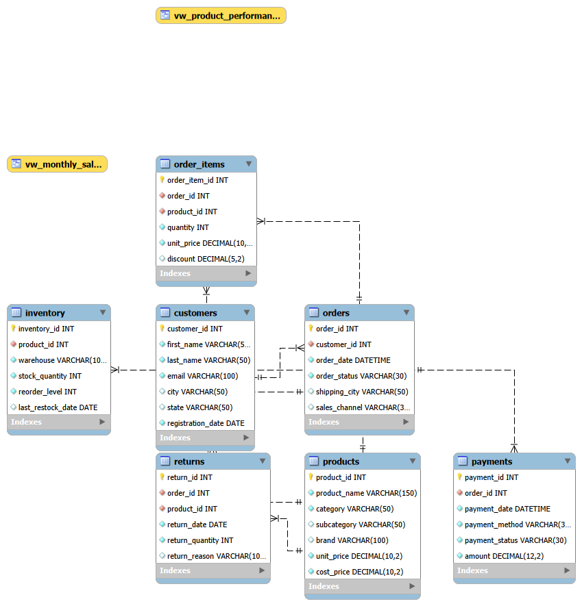

# RetailPulse Analytics using SQL

A small retail analytics project built with MySQL.

This project covers sales, customers, products, orders, payments, returns, and inventory. I used SQL queries to explore the data and find useful business insights.

## What I worked on

* Sales and revenue analysis
* Customer spending and repeat purchases
* Product and category performance
* Order and payment analysis
* Inventory and low-stock analysis
* Returns analysis
* SQL views for reusable analysis

## Tools

* SQL 
* MySQL
* MySQL Workbench

## Database

7 tables with a small sample dataset:

* customers 
* products
* orders 
* order_items 
* payments
* returns
* inventory

## Database Schema

